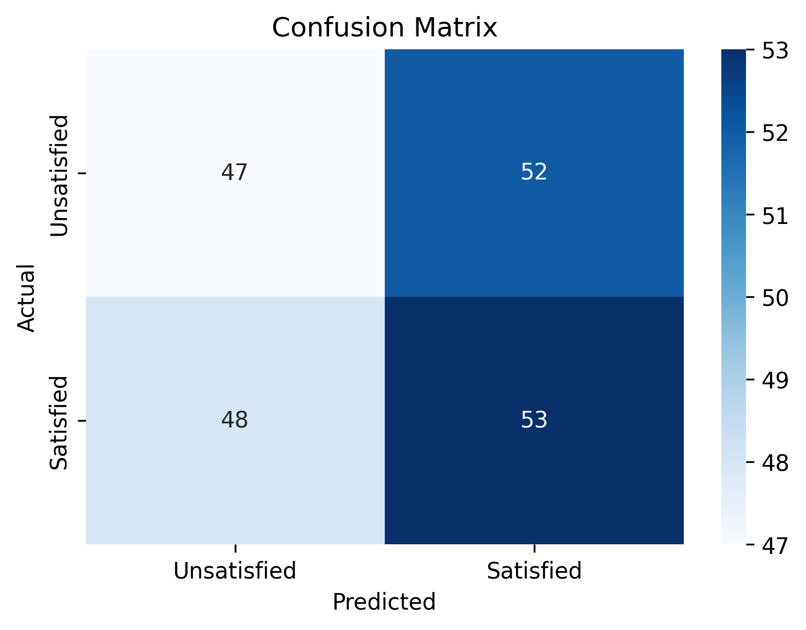
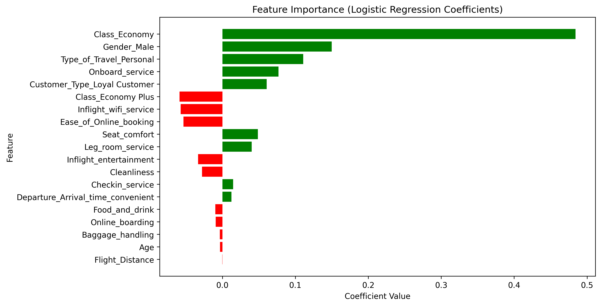

# Airline Customer Satisfaction Prediction (Logistic Regression)

## 📂 Project Structure
📂 Airline-Satisfaction-LogReg
 ┣ 📜 logistic_regression_analysis.ipynb   # Jupyter Notebook with code + outputs
 ┣ 📜 README.md                            # Project summary and results
 ┗ 📂 data/
    ┗ airline_passenger_survey.csv         # Dataset (synthetic or real)

## 📝 README.md Template

### Project Overview
This project analyzes airline passenger survey data using Logistic Regression to predict customer satisfaction.  
We preprocess categorical and numerical features, train/test split the data, fit a Logistic Regression model, and evaluate performance using confusion matrix, precision, recall, and accuracy.

### Dataset
- Synthetic dataset generated with demographic and service rating features.
- Target variable: **Satisfaction** (Satisfied vs Neutral/Dissatisfied).

### Modeling Approach
1. Data preprocessing (encoding categorical variables, scaling if needed).
2. Train/test split (80/20 with stratification).
3. Logistic Regression model fitted using Scikit-learn.
4. Evaluation with confusion matrix, precision, recall, accuracy.
5. Coefficient interpretation for feature importance.

### Results
- **Confusion Matrix**: <br>
| **Actual / Predicted**   | **Unsatisfied**          | **Satisfied** |<br>
| **Unsatisfied**          | 47 (True Negatives)      | 52 (False Positives) |<br>
| **Satisfied**            | 48 (False Negatives)     | 53 (True Positives) |<br>
<br>
 <br>
Model Performance Metrics:<br>
Accuracy: 0.54 <br>
Precision: 0.588 <br>
Recall: 0.467 <br>

### Key Insights
- Positive drivers: [e.g., Seat comfort, Cleanliness, Onboard service]
- Negative drivers: [e.g., Poor Wi-Fi, Check-in service delays]

### Business Recommendations
- Improve inflight Wi-Fi quality to boost satisfaction among business travelers.
- Enhance seat comfort for long-haul flights.
- Streamline check-in service to reduce dissatisfaction.
- Maintain high cleanliness standards.

### Limitations & Next Steps
- Synthetic dataset used; real-world data may differ.
- Future work: try other models (Random Forest, XGBoost), handle class imbalance, deploy model in production.

## Installation & Requirements
- Python 3.8+
- pandas
- numpy
- scikit-learn
- matplotlib
- seaborn

Install dependencies:
```bash
pip install -r requirements.txt

# How to Run the Project
1. Clone the repository
   ```bash
   git clone https://github.com/yourusername/Airline-Satisfaction-LogReg.git
# Navigate into the project folder
cd Airline-Satisfaction-LogReg

# Open the Jupyter Notebook
jupyter notebook logistic_regression_analysis.ipynb

# Results Visualization  
## Visualizations




